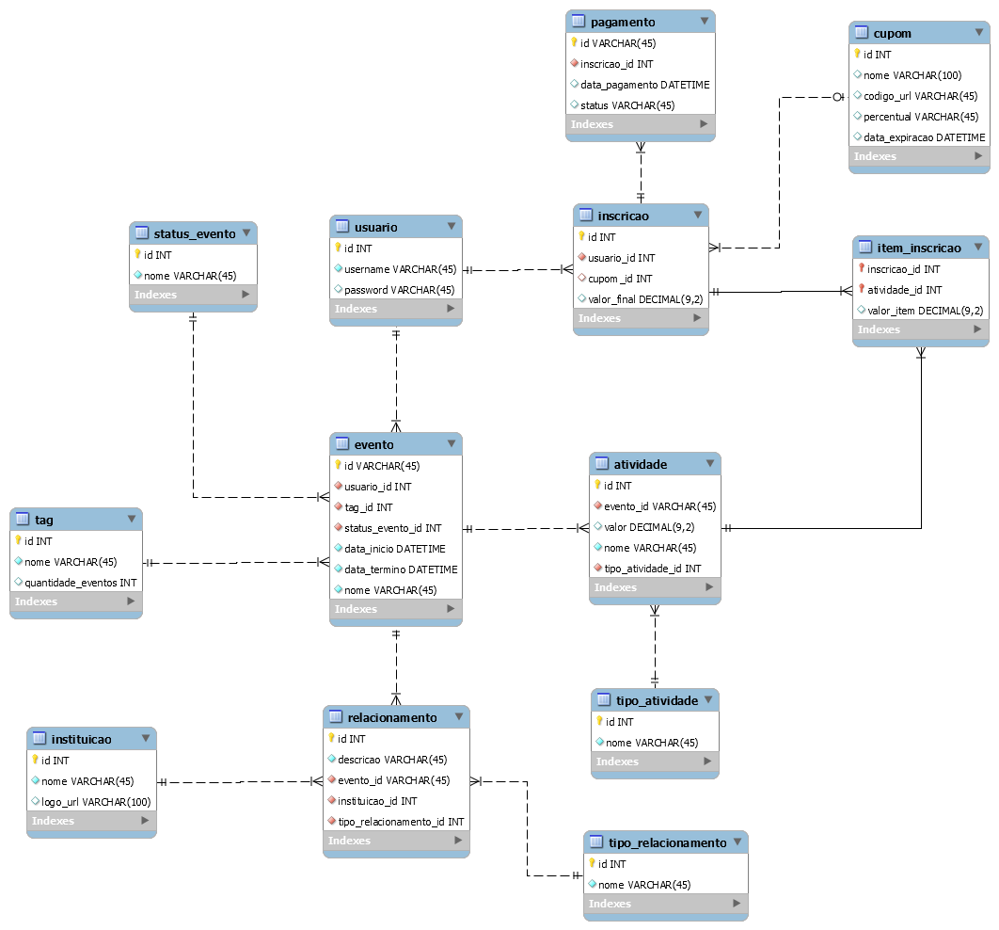

# Friday Team

Repositorio do grupo sobre a ativade de eventos para a disciplina de Programacao Corporativa

### Prototipo (V1):
	
	Sistema capaz de cadastar usuarios, eventos e entidades relacionadas de forma a aprimorar a experiencia de buscas de eventos.

## Projeto

### Diagrama de Classes

### Diagrama de Casos de Uso

### Diagrama Entidae-Relacionamento

## Membros:

* Alexsander Magnum
* Daniel Farias
* Mateus Oliveira
* Wildrimak Pereira

### Recursos ultilizados:

* Python (Bottle Framework)

### Agenda do Projeto:
	https://trello.com/b/2w91uXMv